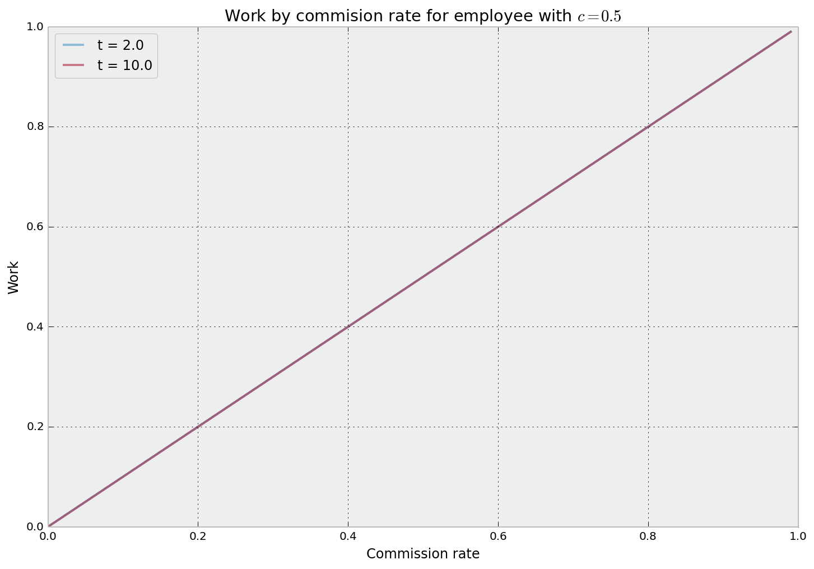

```python
import matplotlib.pyplot as plt
import numpy as np
```

**Question 1**

The way our firm pays its employees can be modelled thusly:
$$\pi=a+\epsilon$$
$$U(w,a)=-e^{-(w-c\cdot a^{2})}$$
$$w=t+s\cdot \pi$$
Where $t$ is the employee's base pay, $U$ is the employee's happiness, $a$ is
the employee's disinclination towards work (which I will refer to as their
"coefficient of laziness"), and $\pi$ is the revenue earned by an employee. We
can plug some numbers into these equations to observe how each of these
variables affects an employee's happiness, holding the rest of the variables
constant.


```python
plt.subplot(311, title='Happiness as a function of $a$')
w=10; c=1; a=np.arange(0,10,.1)
U = -np.exp(-(w - c*a**2))
plt.plot(a, U)

plt.subplot(312, title='Happiness as a function of $w$')
w=np.arange(0,10,.1); c=1; a=2
U = -np.exp(-(w - c*a**2))
plt.plot(w, U)

plt.subplot(313, title='Happiness as a function of $c$')
w=10; c=np.arange(0,10,.1); a=2
U = -np.exp(-(w - c*a**2))
plt.plot(c, U)

plt.tight_layout()
```


We can take away a few patterns from these graphs.

Our workers have a relatively stable happiness regardless of how hard they work,
*until* their level of work begins to approach their pay (at least for a worker
whose $c=1$).

As their pay increases they gradually become happier, plateauing when their pay
reaches 2 or 3 times their level of work (again, for a worker whose $c=1$).

As their disinclination towards work increases, their happiness stays relatively
constant until their laziness approaches their pay, similar to the effect of $a$
but not quite as abrupt.

**Question 2**


```python
def optimize_work(t=2, c=0.5):
    '''For a given value of t and c, searches the space from s = 0% to s = 100%,
    plotting the level of work the employee will choose to maximize his happiness'''
    out = []
    for s in np.arange(0,1,.01):       # Search s-space
        a = np.arange(0,10,.01)        # Worker tries every level of work-ethic
        w = (t + s * a).clip(0)        # Worker sees how much he makes for that amount of work
                                       # Note: clip(0) ensures that pay is non-negative
        U = -np.exp(-(w - c * a**2))   # Worker weighs work against income to evaluate happiness
        idx = np.argmax(U)             # Worker picks work-ethic that maximizes happiness 
        out.append((s, a[idx], U[idx], w[idx]))
    s,a,U,w = zip(*out)
    plt.plot(s, a, label='t = {}'.format(t), alpha=.5)
    plt.legend(loc='best'); plt.xlabel('Commission rate'); plt.ylabel('Work')
    
optimize_work(t=2.0);
optimize_work(t=10.0);
plt.title('Work by commision rate for employee with $c=0.5$');
```





This plot demonstrates the somewhat surprising result that base pay $t$ has no
effect on how hard an employee will work (at least for an employee whose
$c=0.5$). Although a higher base pay will certainly increase their happiness, it
does *not* incentivize them. This fact manifests itself in two ways, first in
the $(0,0)$ origin, reflecting the fact that if we do not include any commission
at all, there is no incentive to do  any work at all (a fact already noted and
bemoaned by my dear father). Second, the slope of the effect is constant across
both (read: any) values of base pay, which is why the lines are actually on top
of each other (hence the purple) and base pay does not make a difference.

**Question 3**

Now that we have a model for how hard each lawyer will work for a given
commision rate, we can determine what our revenue will be for that given
commission rate (at least in expectation). This allows us to optimize for our
profits ($\pi-w$), rather than for the happiness of our lazy-ass employees.


```python
def optimize_profit(t=0, c=0.5, plot=True):
    '''For a given value of t and c, searches the space from s = 0% to s = 100%,
    plots the profit that the firm will generate based on predicted employee behavior'''
    out = []
    for s in np.arange(0,1,.01):       # Search s-space
        a = np.arange(0,10,.01)        # Worker tries every level of work-ethic
        w = (t + s * a).clip(0)        # Worker sees how much he makes for that amount of work
                                       # Note: clip(0) ensures that pay is non-negative
        U = -np.exp(-(w - c * a**2))   # Worker weighs work against income to evaluate happiness
        idx = np.argmax(U)             # Worker picks work-ethic that maximizes happiness 
        out.append((s, a[idx], U[idx], w[idx]))
    s,a,U,w = zip(*out)
    profit = np.array(a) - np.array(w) # Firm calculates profit across s-space acocunting for worker behavior
    if plot:
        plt.plot(s, profit, label='$t = {},\, c = {}$'.format(t, c))
        plt.legend(loc='best'); plt.xlabel('Commission rate'); plt.ylabel('Profit')
    optimized_rate = s[np.argmax(profit)]
    plt.axvline(optimized_rate, ls='--', lw=1, color='black', )
    plt.axhline(0, lw=1, color='black')
    return optimized_rate
    
optimize_profit(.2)
optimize_profit(.1)
optimize_profit(0.)
plt.title('Profit by commision rate for employee with $c=0.5$');
```


Profits are clearly highest when base pay is set to zero (the purple curve),
which represents a purely commission-based payment system. This makes sense in
light of our previous finding that base pay does not incentivize working harder,
which therefore means that it does not actually drive any revenue.

*Regardless of base pay*, **the optimal commission rate is 0.5**, or half of the
employee's earned revenue, which is denoted by the dashed line.

**Question 4**

Different employees will obviously have different propensities for work, which
we represent with different values of $c$ for each employee. Now we will
visualize how the happiness of different employees changes over possible
commission rates we could offer them.


```python
def optimize_happiness(t=0, c=0.5):
    '''For a given value of t and c, searches the space from s = 0% to s = 100%,
    plotting the maximum happiness possible at that value of s'''
    out = []
    for s in np.arange(0,1,.01):       # Search s-space
        a = np.arange(0,10,.01)        # Worker tries every level of work-ethic
        w = (t + s * a).clip(0)        # Worker sees how much he makes for that amount of work
                                       # Note: clip(0) ensures that pay is non-negative
        U = -np.exp(-(w - c * a**2))   # Worker weighs work against income to evaluate happiness
        idx = np.argmax(U)             # Worker picks work-ethic that maximizes happiness 
        out.append((s, a[idx], U[idx], w[idx]))
    s,a,U,w = zip(*out)
    plt.plot(s, U, label='$t = {},\,c={}$'.format(t,c))
    plt.legend(loc='best'); plt.xlabel('Commission rate'); plt.ylabel('Happiness')

optimize_happiness(c=.1)
optimize_happiness(c=.5)
optimize_happiness(c=1.)
plt.title('Happiness by commision rate for employee with no base pay');
```


All three of these employees would end up maximizing their happiness by choosing
a commission rate of 100%, unsurprisingly (those greedy bastards).

Lastly, we will check to see if our optimal commission rate is different for
employees that have different values of $c$.


```python
print 'Best commission rate when c=0.1 is {}'.format(optimize_profit(c=.1, plot=True))
print 'Best commission rate when c=0.5 is {}'.format(optimize_profit(c=.5, plot=True))
print 'Best commission rate when c=1.0 is {}'.format(optimize_profit(c=1., plot=True))
plt.title('Profit by commision rate (assuming no base pay)');
```

    Best commission rate when c=0.1 is 0.5
    Best commission rate when c=0.5 is 0.5
    Best commission rate when c=1.0 is 0.5


It appears that **the optimal commission rate is independent of the employee's
coefficient of laziness**, even though the actual profit the firm makes most
certainly is *not*. Therefore, 0.5 would be our ideal choice for a company-wide
commission rate. Even if the distribution of our employee's coefficients of
laziness was not uniform (for example if we had more lazy employees than hard-
working employees), this optimal commission rate will remain the same.
